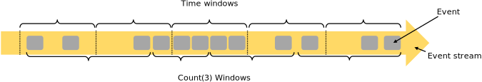

# 数据流编程模型（Dataflow Programming Model）

## 抽象层次（Levels of Abstraction）

- `Low-level`层提供基于`Process Function`编程模型有状态流的简单抽象
- `Core APIs`层提供基于`DataStream`（有界与无界数据流）和`DataSet`（有界数据集）的编程接口
- `Table API`层提供以数据表（关系模型）为中心的声明式DSL编程接口，执行前会通过优化器优化
- `High-level`层提供基于`SQL`的编程接口，基于Calcite进行解析和优化

## Programs and Dataflows

- Source
- Transformation
- Sink

## Parallel Dataflows

`Operators`数据传输（依赖）模式：

- One-to-one(forwarding)
- Redistributing

## Windows

### 驱动（Driven）

- 时间驱动（time driven: every 30 seconds）
- 数据驱动（data driven: every 100 elements）

### 窗口（Windows）

- 滚动窗口（tumbling windows: no overlap）
- 滑动窗口（sliding windows: with overlap）
- 会话窗口（session windows: punctuated by a gap of inactivity）

## Time

- 事件时间（Event Time）
- 摄入时间（Ingestion Time）
- 处理时间（Processing Time）

## Stateful Operations

- Keyed & Operator State
- Raw and Managed State

## Checkpoints for Fault Tolerance

- Checkpoint
- Replay

## Batch on Streaming

- Fault tolerance: replay
- Stateful operations: in-memory/out-of-core data structures
- Iteration: superstep based

# Reference

- [Dataflow Programming Model](https://ci.apache.org/projects/flink/flink-docs-master/concepts/programming-model.html)