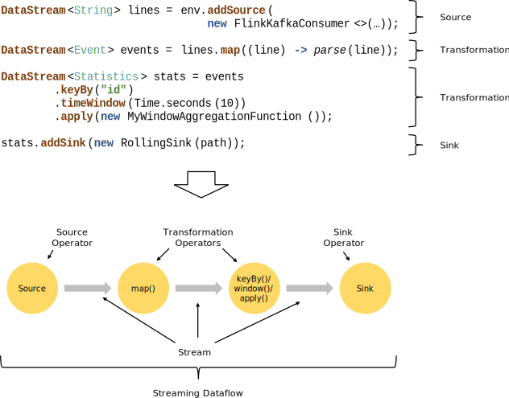

# 数据流编程模型（Dataflow Programming Model）

## 抽象层次（Levels of Abstraction）

- `Low-level`层提供基于`Process Function`编程模型有状态流的简单抽象
- `Core APIs`层提供基于`DataStream`（有界与无界数据流）和`DataSet`（有界数据集）的编程接口
- `Table API`层提供以数据表（关系模型）为中心的声明式DSL编程接口，执行前会通过优化器优化
- `High-level`层提供基于`SQL`的编程接口

## Programs and Dataflows

## Parallel Dataflows

## Windows

## Time

## Stateful Operations

## Checkpoints for Fault Tolerance

## Batch on Streaming

# Reference

- [Dataflow Programming Model](https://ci.apache.org/projects/flink/flink-docs-master/concepts/programming-model.html)